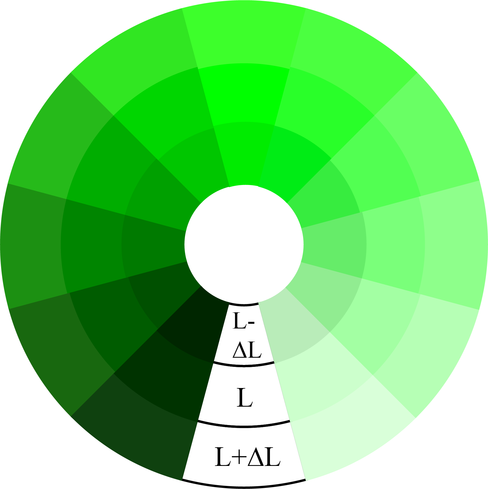

# ChromaCode: A Fully Imperceptible Screen-Camera Communication System

This page illustrates several high resolution images (Figure 3 in the paper) of our paper "ChromaCode: A Fully Imperceptible Screen-Camera Communication System", to appear in ACM MobiCom'18. 

## Impact of color space

The below figures depict the user-perceptual uniformity under HSL, a non-uniform color space, and CIELAB, a uniform color space respectively. 
In the first two figures (Hue palettes), the original colors (middle of the each sector) are of the same saturation (100%) and lightness (50%), but are different in hue ranging from 0 to 300. 
For each original color, we increase and decrease the lightness (outer and inner sector) by the same amount
(∆L = 4%). 
As seen, given the same lightness changes, the resulted color differences are considerably more uniform (meaning that the perceptually color changes are more close under the same amount of lightness changes) in
CIELAB space, regardless of the hue values. 
Similar results can be observed in the later two figures (Lightness palettes) where we keep hue (120) and
saturation (100%) unchanged and alter lightness dimension from 10% to 90%.

<table align="center">
  <tr>
    <td></td>
    <td></td>
  </tr>
  <tr>
    <td align="center">Hue palette in HSL color space<a href="images/hue_plate_hsl.pdf">[PDF]</a></td>
    <td align="center">Hue palette in LAB color space with CIEDE2000<a href="images/hue_plate_lab.pdf">[PDF]</a></td    
  </tr>
</table>

<table align="center">
  <tr>
    <td></td>
    <td></td>
  </tr>
  <tr>
    <td align="center">Lightness palette in HSL color space<a href="images/lightness_plate_hsl.pdf">[PDF]</a></td>
    <td align="center">Lightness palette in LAB color space with CIEDE2000<a href="images/lightness_plate_lab.pdf">[PDF]</a></td>    
  </tr>
</table>

## Impact of texture

The below shows the impacts of video texture on perceptual lightness changes. 
As seen, smooth regions usually expose noticeable flicker more easily while textured regions help hide flicker.

<table align="center">
  <tr>
    <td></td>
  </tr>
  <tr>
    <td align="center">Texture plate<a href="images/texture_plate.pdf">[PDF]</a></td>
  </tr>
</table>
